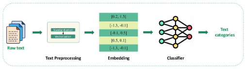

# **Text Classification using Mamba**

### **1. Quy trình**

#### B1: Tiền xử lý dữ liệu:
- **Chuẩn hóa văn bản:** đưa nội dung về chữ thường, loại bỏ dấu câu, ký tự đặc biệt, khoảng trắng thùa và các yếu tố không cần thiết như HTML tags. 

- **Tách từ:** chia nhỏ câu thành các đơn vị từ (token). 

- **POS tagging:** gán nhãn từ loại (như danh từ, động từ, tính từ, trạng từ), mục tiêu là trích xuất ngữ pháp có giá trị, hỗ trợ lựa chọn từ ngữ quan trọng và loại bỏ những thành phần mang ít thông tin. 

- **Loại bỏ từ không quan trọng:** a, an, và, của, is,....

- **Chuẩn hóa từ vựng:**:

    - **Stemming:** running -> run, stopped -> stop,...
    - **Lemmatization:** chuyển đổi từ về dạng gốc có nghĩa (better -> good, worse -> bad, ...) 

#### B2: Embedding
Một sô thuật toán có thể được dùng ở bước này: (1) **Bag of Words (BoW)**; (2) **TF-IDF**; (3) **Word Embeddings - Word2Vec** ; (4) **Transformer-based Embeddings**

Riêng (4): **BERT** là một mô hình Transformer-based mạnh mẽ giúp tạo biểu diễn văn bản cho ngữ cảnh. Thay vì sử dụng embeddings tĩnh như Word2Vec thì BERT nắm bắt ý nghĩa của từ dựa trên toàn bộ câu. 

#### B3: Classifier
Một số mô hình nổi tiếng trong phân loại văn bản được sử dụng là: RNN/LSTM đến các mô hình như Transformer như BERT hay RoBERTa. Nhưng gần đây có một phương pháp khác nổi lên như **Mamba** được đánh giá cao nhờ khả năng xử lý dữ liệu tuần từ mạnh mẽ mà không cần cơ chế attention. 

### **2. Tổng quan về Mamba**
Mamba là mô hình thuộc họ **Mô hình Không gian trạng thái có Cấu trúc** (Structured State Space Models - SSM) và được phát triển nhằm khắc phục những hạn chế của kiến trúc Transformers truyền thống trong việc xử lý các chuỗi dữ liệu dài. 

Một số đặc điểm nổi bật: 

- **Loại bỏ cơ chế Attention:** thay cơ chế attention bởi một khối SSM thống nhất, nhằm giảm tốc độ tính toán và tăng tốc độ suy luận. 

- **Xử lý chuỗi dài hiệu quả:** nhờ vào thiết kế đặc biệt, Mamba có thể xử lý hiệu quả các chuỗi dài lên đến hàng triệu token. 

- **Tối ưu hóa phần cứng**

#### 2.1 Cơ chế chọn lọc 

        Nếu Transformer lưu trữ toàn bộ thông tin và chỉ chọn lọc khi truy xuất, thì Mamba sẽ kết hợp cả hai cách tiếp cận này bằng cách loại bỏ thông tin ít quan trọng sớm hơn trong quá trình ghi nhớ và lưu trữ, giúp tăng tốc độ và tối ưu tài nguyên. 

#### 2.2 Tối ưu hóa phần cứng
- Tối ưu hóa bộ nhớ - Giảm thời gian truyền tải dữ liệu và tăng tốc xử lý bằng cách thiết kế mở rộng trạng thái của Mamba sao cho phù hợp với bộ nhớ băng thông cao. 

- Tối đa hóa xử lý song song. 

Tóm lại, Mamba dùng cơ chế Selection - chỉ chọn lọc phần quan trọng nhất để dự đoán nhằm giảm chi phí tính toán chứ không xử lý toàn bộ ngữ cảnh như Transformers. 

Và không như Transformers, Mamba không bị ảnh hưởng bởi độ dài của chuỗi vì nó chỉ cần trạng thái ẩn cuối cùng để dự đoán. 

