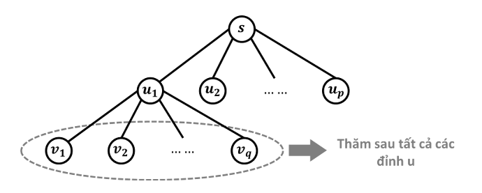
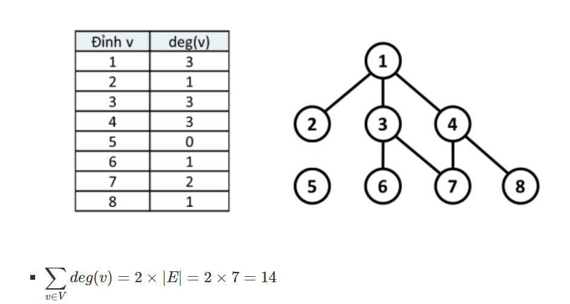

# Overview 

## 1. Bread First Search (Thuật toán duyệt đồ thị theo chiều rộng)
Thuật toán duyệt đồ thị theo chiều rộng (BFS) là một trong những thuật toán tìm kiếm cơ bản và thiết yếu trên đồ thị. Trong đó, những đỉnh nào gần đỉnh xuất phát hơn sẽ được duyệt trước. 

Dùng cho bài toán duyệt đồ thị không có trọng số hoặc các trọng số bằng nhau. 

### 1.1 Ý tưởng: 
Trên đồ thị không có trọng số (đồ thị có hướng hoặc không có hướng) với đỉnh nguồn **s**. Thuật toán có thể được mô tả như sau: 

* Đầu tiên, thăm đỉnh nguồn s 
* Việc thăm đỉnh **s** sẽ phát sinh thứ tự thăm các đỉnh **(u1,u2,…up)** kề với s
(những đỉnh gần s nhất). Tiếp theo, ta thăm đỉnh u1, khi thăm đỉnh u1 sẽ lại phát sinh yêu cầu thăm những đỉnh (v1,v2,…,vq) kề với u1. Nhưng rõ ràng những đỉnh v này “xa” s hơn những đỉnh u nên chúng chỉ được thăm khi tất cả những đỉnh u đều đã được thăm. Tức là thứ tự thăm các đỉnh sẽ là: **s,u1,u2,…,up,v1,v2,…,vq,…**

Thuật toán BFS sử dụng một danh sách để chứa những đỉnh đang "chờ" thăm. Tại mỗi bước, ta thăm một đỉnh đầu danh sách, loại nó ra khỏi danh sách và cho những đỉnh kề với nó chưa được thăm xếp hàng vào cuối danh sách. Thuật toán sẽ kết thúc khi danh sách rỗng. 

### 1.2 Thuật toán: 
Thuật toán sử dụng cấu trúc dữ liệu hàng đợi (queue) để chứa các đỉnh sẽ được duyệt theo thứ tự ưu tiên chiều rộng. 

**Bước 1:** Khởi tạo

* Các đỉnh đều ở trạng thái chưa được đánh dấu. Ngoại trừ đỉnh nguồn. 

* Một hàng đợi ban đầu chỉ chứa một phần tử **s**. 

**Bước 2:** Lặp lại các bước cho đến khi hàng đợi rỗng. 

* Lấy đỉnh **u** ra khỏi hàng đợi.
* Xét tất cả những đỉnh kề với **u** mà chưa được đánh dấu, với mỗi đỉnh **v** đó: 
    
    * Đánh dấu v đã thăm. 
    * Lưu lại vết đường đi từ **u** đến **v**. 
    * Đẩy **v** vào trong hàng đợi (đỉnh **v** sẽ chờ được duyệt tại những bước sau). 

### 1.3 Độ phức tạp:

Cho đồ thị, gồm |V| đỉnh và |E| cạnh. 

* Độ phức tạp khi biểu diễn bằng danh sách kề: O(**|V|** + **|E|**) 
* Độ phức tạp khi biểu diễn bằng ma trận kề: O($|V|^2$)

## 2. Định lý Handshaking Lemma: 
### **Định lý:**  
    Trong một đồ thị bất kỳ, tổng số bậc của tất cả các đỉnh bằng gấp đôi số cạnh của đồ thị. 

Cho đồ thị G = (V, E) gồm |V| đỉnh và |E| cạnh. Khi đó, tổng tất cả các bậc của đỉnh trong G bằng 2 x |E|. Với deg(v) là số bậc của đỉnh v, ta có: $\sum_{v \in V}$ deg(v) = 2.|E| 

