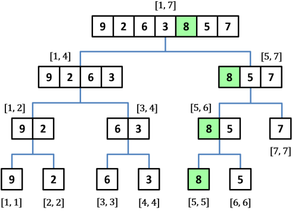

# Overview 

## 1. Segment Tree 
Segment Tree là một cấu trúc dữ liệu linh hoạt được sử dụng nhiều trong các bài toán xử lý trên dãy số. 

### 1.1 Cấu trúc:
- Segment Tree là một cây. Cụ thể hơn, nó là một cây nhị phân đầy đủ (mỗi nút là lá hoặc có đúng  nút con).
- Mỗi nút quản lý một dãy các đối tượng liên tiếp, trong nút chứa thông tin tổng hợp từ các đối tượng mà nó quản lý. 
- Với một dãy số gồm N phần tử, nút gốc quản lý các đối tượng từ 1 đến N 
- Nếu một nút quản lý dãy các đối tượng từ  tới **l** tới **r**  thì nút con trái của nó quản lý các đối tượng từ **l** tới **mid** và nút con phải của nó quản lý các đối tượng từ **mid + 1** tới *r**.
- Nếu một nút chỉ quản lý một đối tượng thì nó sẽ là nút lá và không có nút con. 
- Chiều cao của Segment Tree là **O(logN)**, bởi vì khi đi xuống từ gốc đến lá, kích thước của mỗi đoạn giảm đi một nửa. 
- Tại mỗi độ sâu của cây, không có phần tử nào được quản lý bởi 2 nút khác nhau của cây. 

### 1.2 Các thao tác trên cây phân đoạn: 
Có 3 thao tác cơ bản trên Segment Tree.
#### 1.2.1 Xây dựng: 
Trước khi xây dựng cây phân đoạn, ta cần quyết định: 
- Thông tin được lưu trữ tại mỗi nút của cây phân đoạn. 
- Phép toán hợp nhất hai nút con trong một cây phân đoạn. 

Có hai cách để xây dựng một cây phân đoạn: 
- **Xây dựng từ dưới lên trên:** Để xây dựng cây phân đoạn, ta sẽ bắt đầu ở các nút có độ sâu thấp nhất (các nút lá) và gán cho chúng các giá trị tương ứng. Rồi từ đó, ta có thể tính toán lên các nút cha bằng cách "hợp nhất" lần lượt 2 nút con và lặp lại quy trình cho đến khi đạt đến đỉnh gốc.

- **Xây dựng từ trên xuống dưới:** cấu trúc từ trên xuống là sử dụng **đệ quy**.

#### 1.2.2 Cập nhật: 
#### 1.2.3 Truy xuất: 
